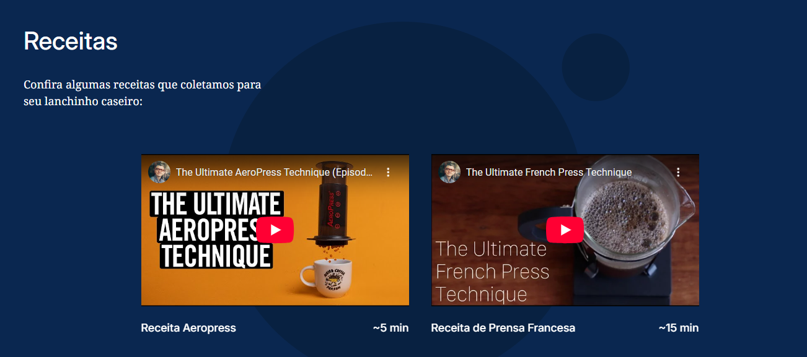
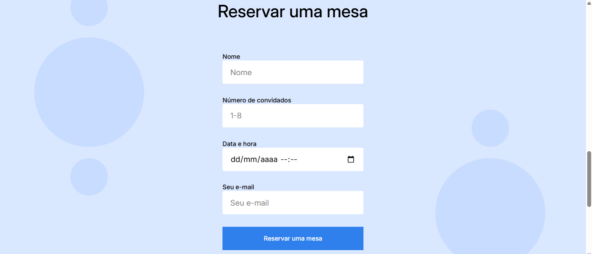

# Projeto 4: Triple Espresso

Neste projeto criamos do zero os códigos HTML e CSS, de acordo com o roteiro. O projeto foi dividido em 4 etapas, onde trabalhamos recursos avançados de HTML e CSS, Incorporação de conteúdo com elementos <iframe>, aprendemos a construir um formulário e a organizar arquivos com a metodologia BEM Flat.

# Planos de melhoria

Futuramente, gostaria de colocar uma animação de entrada no conteúdo do cabeçalho (título, subtítulo e imagem), para dar mais dinamismo para a página.
